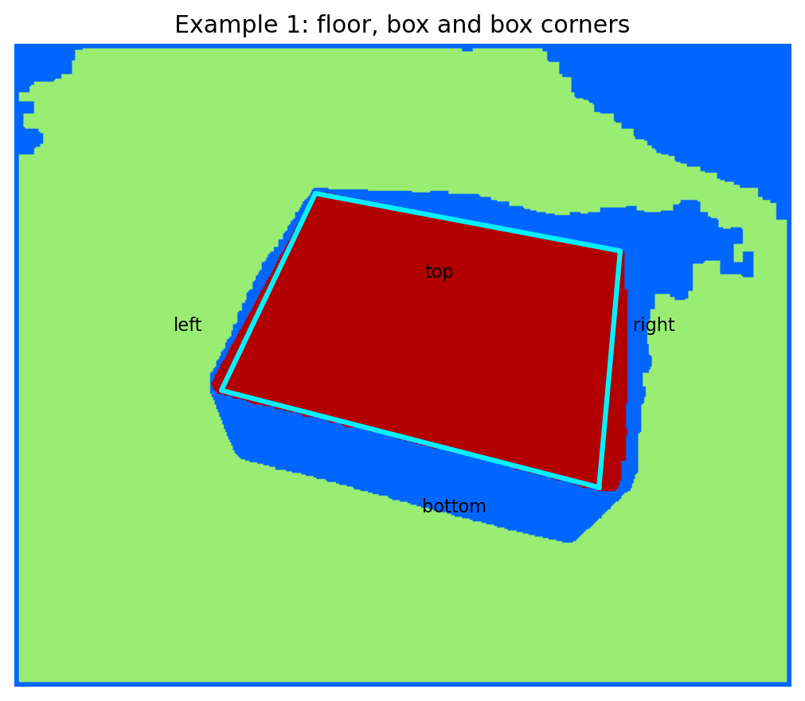
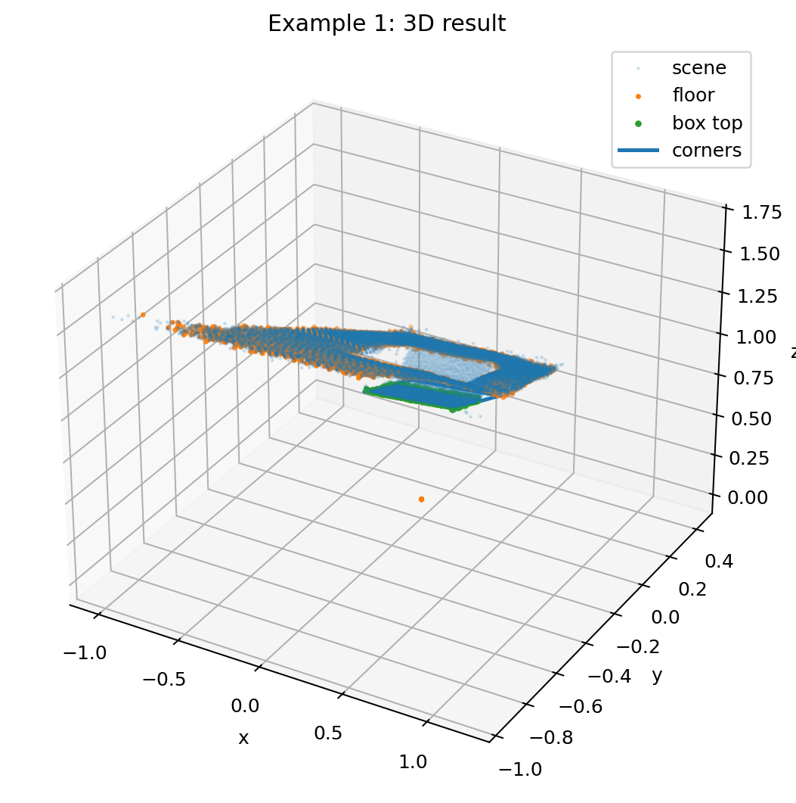
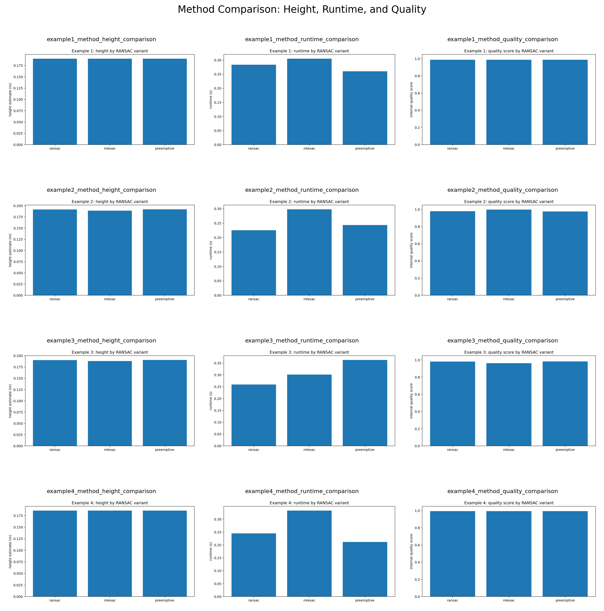

# 01 Box Detection with RANSAC

The goal here was to measure a box (length, width and height) using data from a Kinect sensor. Each scene comes with an amplitude image, a distance image and a 3D point cloud.
The exercise asked us to write RANSAC ourselves instead of using the scikit-learn version, so all plane fitting in this folder is our own code.

<p align="center">
  
  
</p>

## Group solution ([`group/`](group/))
Done together with Neelesh Babu.

We first fit the floor plane with RANSAC and turn its inliers into a mask, which we clean up with closing and then opening.
After removing the floor we run RANSAC a second time to find the top of the box and keep the largest connected region.
The height comes from the distance between the box top and the floor, and length and width come from a bounding box aligned with PCA.

| Example | Length (m) | Width (m) | Height (m) | Height check (m) |
|---:|---:|---:|---:|---:|
| 1 | 0.649 | 0.470 | 0.189 | 0.193 |
| 2 | 0.472 | 0.402 | 0.189 | 0.192 |
| 3 | 0.474 | 0.399 | 0.192 | 0.190 |
| 4 | 0.470 | 0.374 | 0.184 | 0.185 |

There is a longer write up in [`group/README.md`](group/README.md) and the discussion is in [`group/report/`](group/report/).

## My individual extension ([`individual/`](individual/))
For my part I wrote three plane fitting methods and compared them on all four scenes: standard RANSAC, MLESAC (which scores a plane by likelihood instead of just counting inliers) and preemptive RANSAC (which throws away weak candidates early to save time).
I also tuned the inlier threshold and the number of iterations, measured runtimes and ran a paired hypothesis test on the runtimes.

<p align="center"></p>

More details are in [`individual/README.md`](individual/README.md) and [`individual/report/discussion.pdf`](individual/report/discussion.pdf).

## Running it

```bash
pip install -r requirements.txt
# copy example1kinect.mat to example4kinect.mat from the course into data/
cd group && python3 box_detection_solution.py
cd individual && python3 box_detection_individual_task.py --mode full
```
If you only want a quick check, use `--mode compare` instead of `--mode full`.
