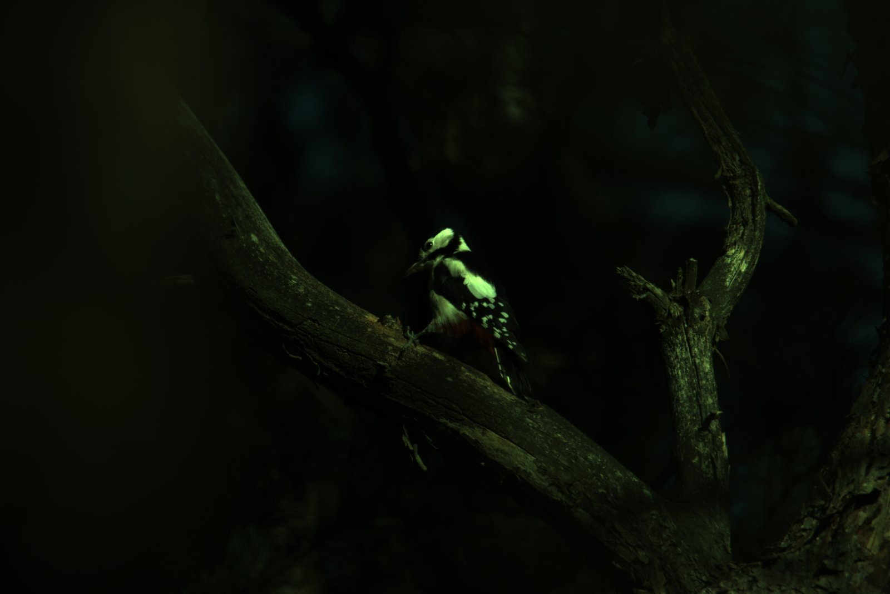
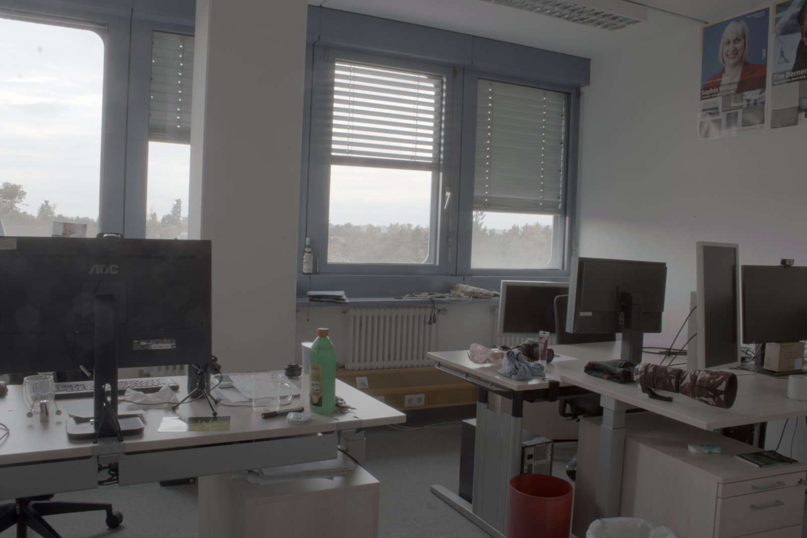
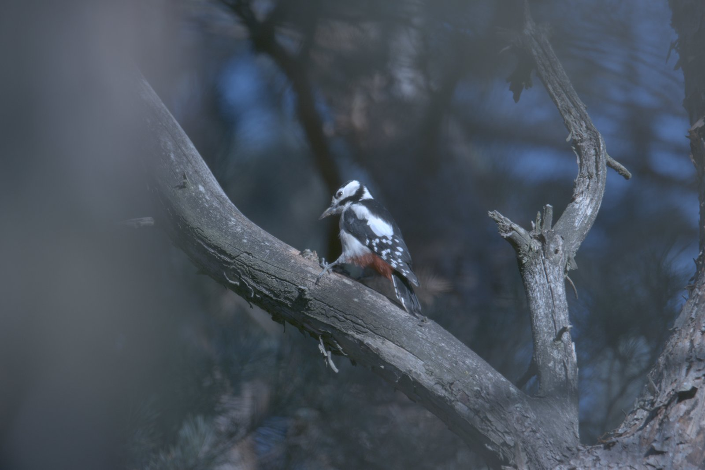
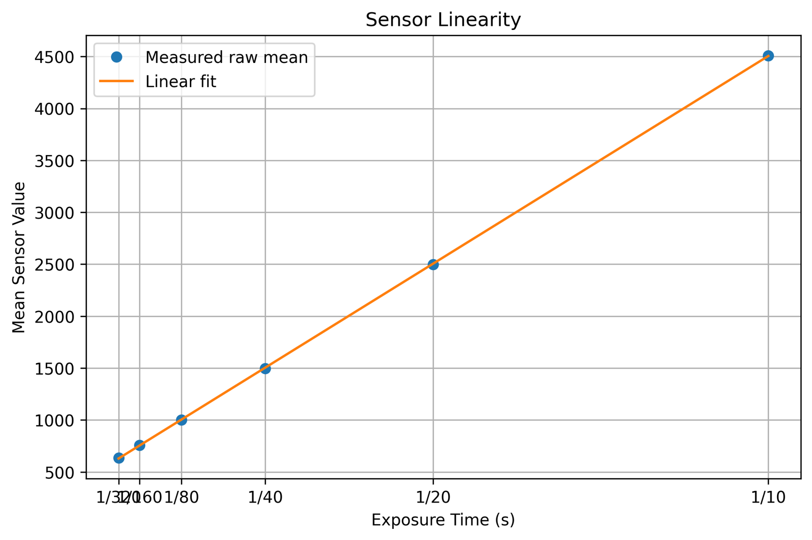
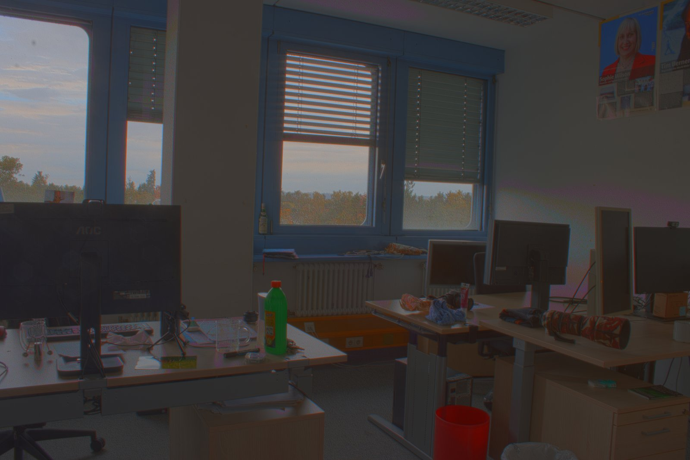
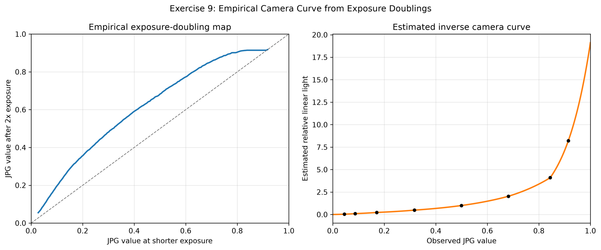
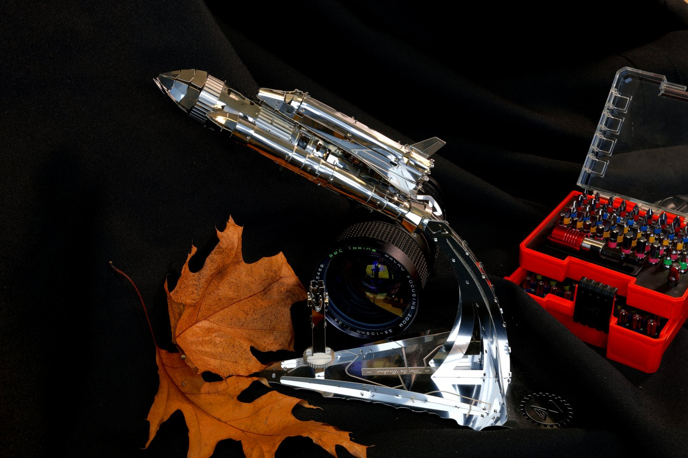

# 02 Demosaicing and HDR

This exercise goes all the way from raw camera sensor values to an image you can actually look at. It covers demosaicing, tone curves, white balance, HDR merging and tone mapping.

<p align="center">
  
  
  
</p>
<p align="center"><em>Demosaiced RAW image, HDR with log tone mapping, and the output of our final process_raw function</em></p>

## Group solution ([`group/demosaicing_solution.py`](group/demosaicing_solution.py))

| Task | What we did |
|---|---|
| 1 | Worked out the Bayer pattern of the sensor (GBRG) from a test photo |
| 2 | Demosaicing with masked convolution |
| 3 | Tried different luminosity curves (gamma 0.3, log, square root, inverse) |
| 4 | Gray world white balance |
| 5 | Checked how linear the sensor is across exposures |
| 6 | Merged RAW exposures into an HDR image and applied log tone mapping |
| 7 | iCAM06 tone mapping using a bilateral filter to split base and detail |
| 8 | One function, process_raw, that runs the whole pipeline |

<p align="center">
  
  
</p>

## My individual extension: HDR from JPG images ([`individual/`](individual/))
JPG values are not linear in light, so you have to undo the camera curve before merging exposures.
Instead of just assuming a gamma curve, I estimated the curve from the photos themselves.
I took pairs of images where the exposure time doubles and looked at how each JPG value changes between them.
From that I built the inverse response using the rule that doubling the exposure should double the linear light value, g(D(y)) = 2 g(y).
After linearising the images I merged them into an HDR image and applied log tone mapping.

<p align="center">
  
  
</p>

The full report is in [`individual/report/exercise9_report.pdf`](individual/report/exercise9_report.pdf) and the exposure times I read from the EXIF data are in [`individual/jpg_exif_metadata.md`](individual/jpg_exif_metadata.md).

## Running it

```bash
pip install -r requirements.txt
# the course RAW files go in data/ and the JPG exposure series in data/hdr-jpg/
cd group && python3 demosaicing_solution.py
cd individual && python3 exercise9_ind.py
```

The result images in this repo are scaled down to keep the repo small.
