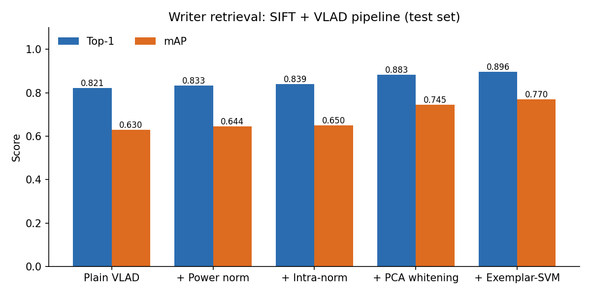
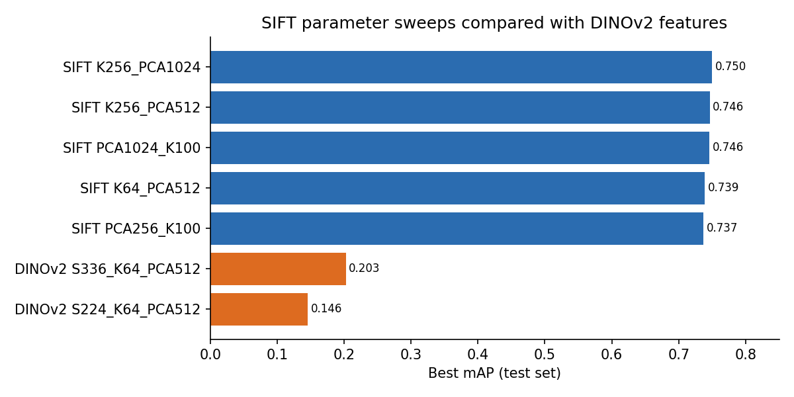

# 03 Writer Identification

Given a page of historical handwriting, the task is to find other pages written by the same person.
Every page is turned into one global descriptor, and we measure how well retrieval works with Top 1 accuracy and mean average precision (mAP).

## Group solution ([`group/exercise3_group.py`](group/exercise3_group.py))
We extract SIFT descriptors (with the keypoint orientation fixed to 0 and Hellinger normalisation), learn a codebook of 100 visual words with MiniBatchKMeans and encode each page with VLAD.
On top of that we added power and intra normalisation, PCA whitening down to 512 dimensions and finally an Exemplar SVM for every query.

<p align="center"></p>

| Variant | Top 1 | mAP |
|---|---:|---:|
| Plain VLAD | 0.821 | 0.630 |
| with power normalisation | 0.833 | 0.644 |
| with intra normalisation | 0.839 | 0.650 |
| with PCA whitening | 0.883 | 0.745 |
| with Exemplar SVM | 0.896 | 0.770 |

The report is in [`group/report/report.pdf`](group/report/report.pdf).

## My individual extension ([`individual/`](individual/))
I ran two sets of experiments.
In [`parameter_sensitivity/`](individual/parameter_sensitivity/) I changed the codebook size (64, 100 and 256) and the PCA dimension (256, 512 and 1024).
In [`dinov2/`](individual/dinov2/) I replaced SIFT with patch features from DINOv2 (ViT S/14), a self supervised vision transformer.

<p align="center"></p>

The SIFT and VLAD pipeline turned out to be quite stable, with mAP between 0.74 and 0.75 for every setting I tried.
DINOv2 features without any fine tuning did a lot worse on the binarised handwriting, reaching an mAP of only about 0.20.

My report is in [`individual/report/report.pdf`](individual/report/report.pdf).

## Running it

```bash
pip install -r requirements.txt
python3 group/exercise3_group.py \
  --in_train <train_images> --labels_train <train_labels.txt> \
  --in_test  <test_images>  --labels_test  <test_labels.txt>
```
The individual scripts take the same arguments. The DINOv2 model is downloaded through torch.hub the first time you run it.
