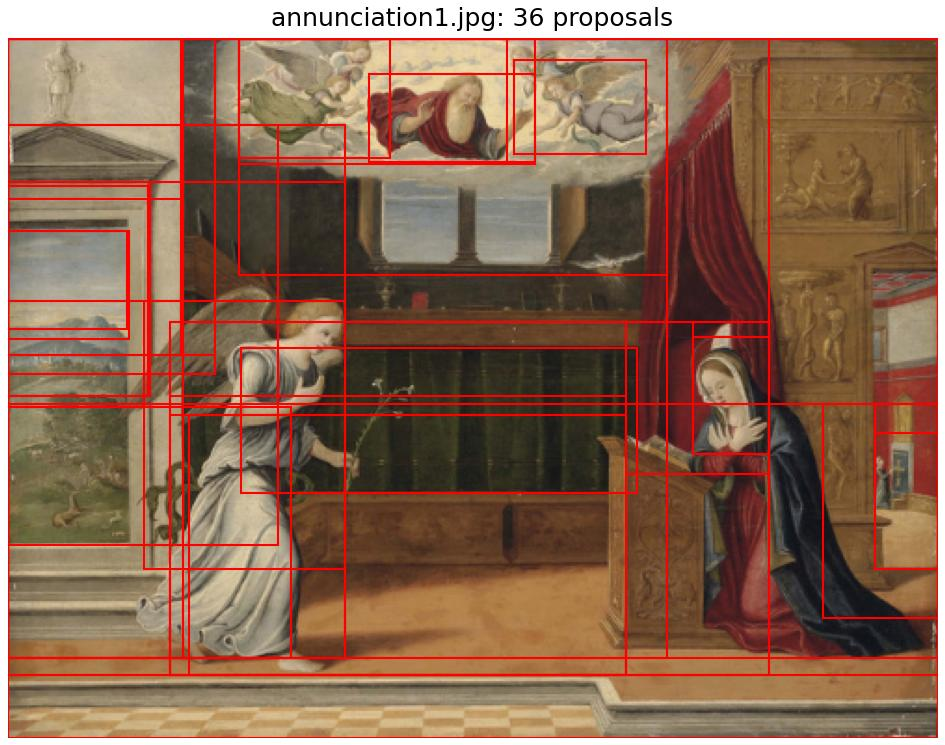
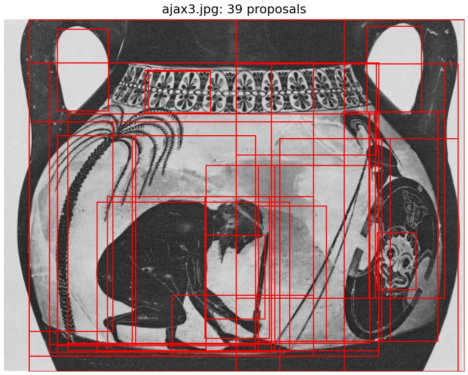
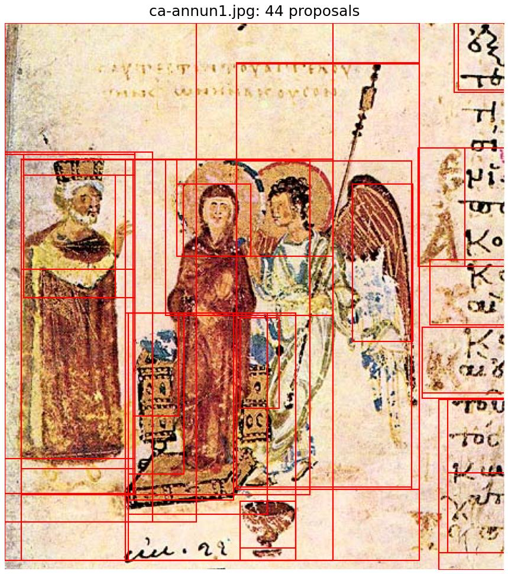
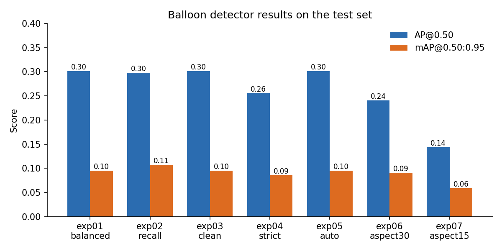
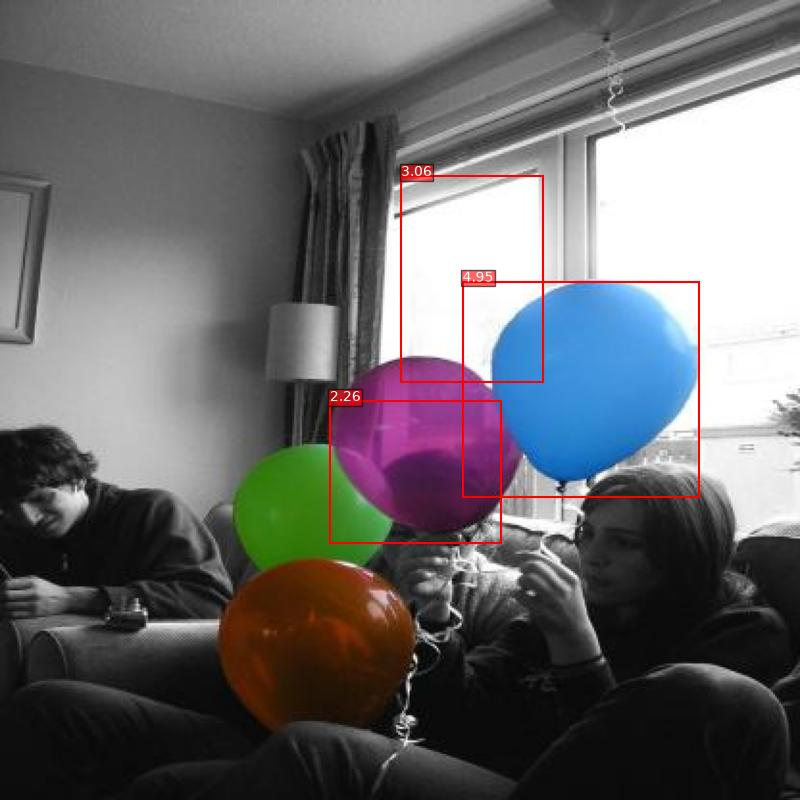
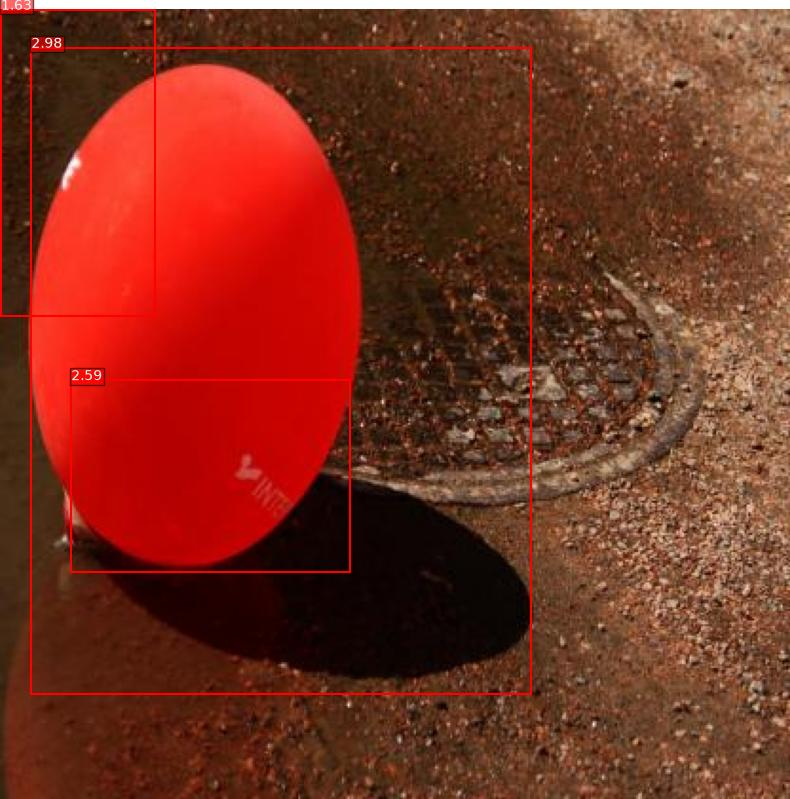

# 04 Selective Search and Object Detection

## Group solution: Selective Search from scratch ([`group/`](group/))
Done together with Neelesh Babu.

We implemented Selective Search (Uijlings et al.) ourselves and ran it on art history images showing Christian iconography and classical archaeology.
The image is first over segmented with the Felzenszwalb algorithm.
Each region is then described by colour, texture, size and fill similarity to its neighbours, and the most similar neighbours are merged step by step.
After every merge the old similarities are removed and new ones are computed for the merged region.
Every region that appears along the way becomes a bounding box proposal.

<p align="center">
  
  
  
</p>

Our written answers are in [`group/report/written_report.pdf`](group/report/written_report.pdf).

## My individual extension: a balloon detector ([`individual/`](individual/))
For the individual part I built a small detection pipeline in the style of R CNN, but without any deep learning.

1. Selective Search proposals at three scales (k = 100, 150 and 250)
2. HOG, colour histogram and shape features for every proposal
3. A linear SVM trained with hard negative mining and extra augmented positives
4. Filtering by score and non maximum suppression
5. Evaluation with the COCO metrics AP@0.5 and mAP@0.5:0.95

I used the Roboflow Balloon dataset (COCO format, 42 training, 12 validation and 6 test images, CC BY 4.0). It is not included in the repo.

<p align="center"></p>

<p align="center">
  
  
</p>

The trained SVM for each of the 7 experiments is in [`individual/models/`](individual/models/) and can be loaded with `joblib.load`.
Metrics and COCO predictions for every experiment are in [`individual/results/`](individual/results/), and my report is [`individual/report/report_5_2.pdf`](individual/report/report_5_2.pdf).

## Running it

```bash
pip install -r group/requirements.txt
cd group && python3 code/main.py --data data      # expects data/arthist, data/chrisarch and data/classarch

pip install -r individual/requirements.txt
cd individual/code && python3 detection_pipeline.py --data-dir ../data/balloon_dataset --results-dir ../results/run
```
