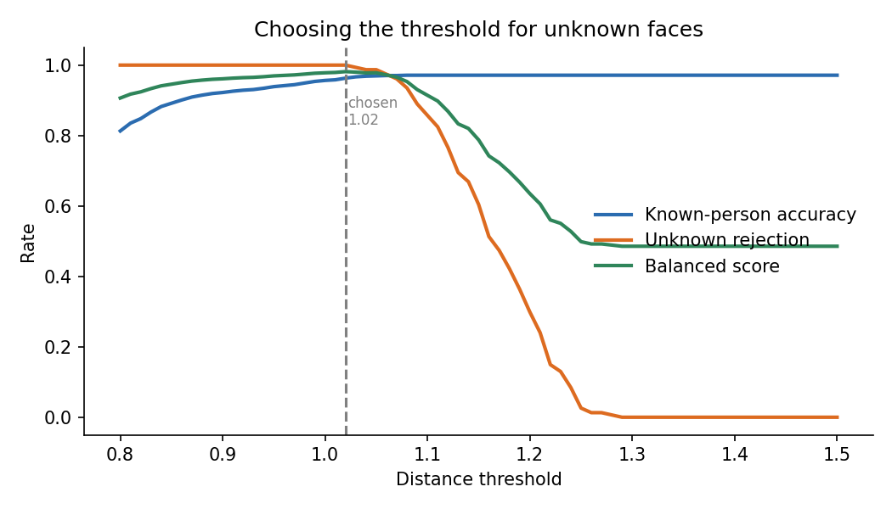
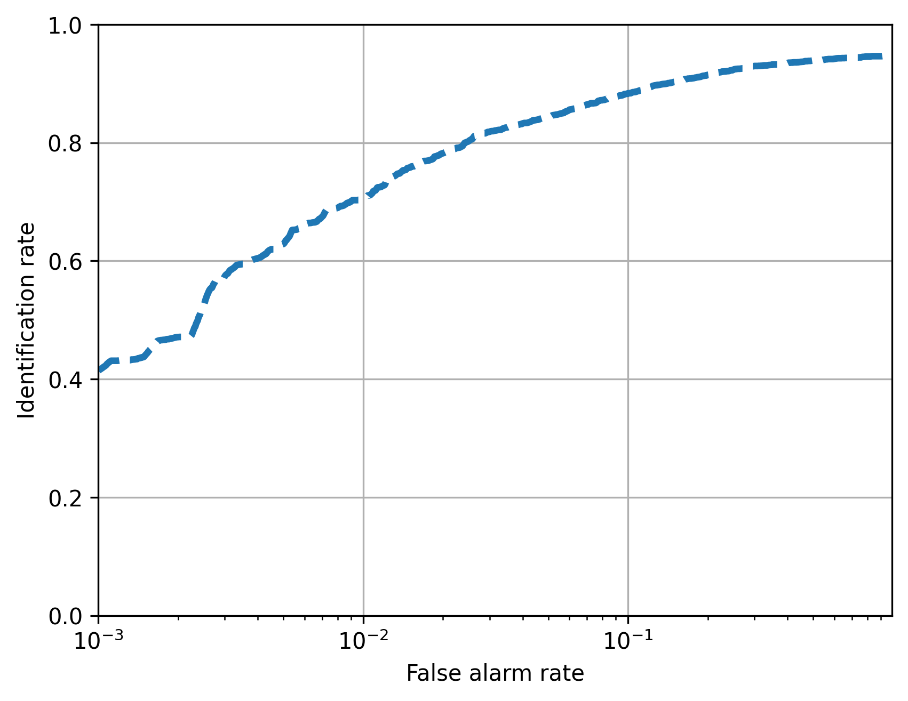
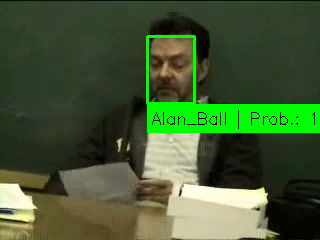
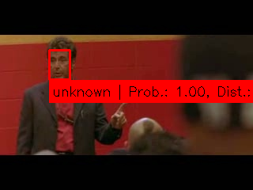
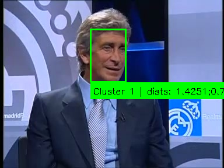

# 05 Face Recognition and Open Set Recognition

This exercise is about recognising known people in video, and just as important, saying "I don't know this person" when someone new shows up.

## Group solution ([`group/`](group/))
This part was team work.

* Faces are found with MTCNN and followed with template tracking. We run the detector again every few frames, because the tracker drifted otherwise.
* Each face is turned into an embedding with a ResNet 50 face model and classified with k nearest neighbours. Distance and probability thresholds decide when a face counts as unknown.
* For re identification we cluster the embeddings with k means.
* We evaluated the system with DIR curves (detection and identification rate against false alarm rate).

| Setting | Known people correct | Unknown people rejected |
|---|---:|---:|
| detector every 5 frames, threshold 1.02 | 1040 of 1080 (96.3 %) | 154 of 154 (100 %) |
| detector on every frame (slower, best case) | 1068 of 1080 (98.9 %) | 154 of 154 (100 %) |

The DIR is 0.71 at a false alarm rate of 1 % and 0.88 at 10 %.

<p align="center">
  
  
</p>
<p align="center">
  
  
  
</p>

The trained galleries are in [`group/models/`](group/models/). If you copy them into `group/data/` as `recognition_gallery.pkl` and `clustering_gallery.pkl`, you can skip training.
Logs, predictions and metrics are in [`group/results/logs/`](group/results/logs/), and the report is [`group/report/group_report_ex04.pdf`](group/report/group_report_ex04.pdf).

## My individual extension: open set challenge ([`individual/`](individual/))
In the challenge, some training samples are marked as "known unknowns", meaning faces of people who are not in the gallery. I tried two ways to use them.

* Single Pseudo Label: all known unknowns go into one shared background class.
* Multi Pseudo Label: the known unknowns are split into several pseudo classes, and any prediction of one of them is mapped back to unknown.

The code is in [`individual/cvproj_exc/osr_learning.py`](individual/cvproj_exc/osr_learning.py), the unit tests in [`individual/test_osr_learning.py`](individual/test_osr_learning.py) (all 6 pass), and my report is [`individual/report/individual_report_ex04.pdf`](individual/report/individual_report_ex04.pdf).

## Running it

```bash
pip install -r group/requirements.txt
# the course data (train_data, test_data, resnet50_128.onnx and the evaluation pkl files) goes into group/data/
cd group
python3 -m cvproj_exc.training      # builds the galleries
python3 save_ident_results.py       # identification results
python3 save_cluster_results.py     # clustering results
python3 save_dir_results.py         # DIR curve
python3 threshold_sweep.py          # threshold sweep for unknown rejection

cd ../individual && python3 -m unittest test_osr_learning.py
```
